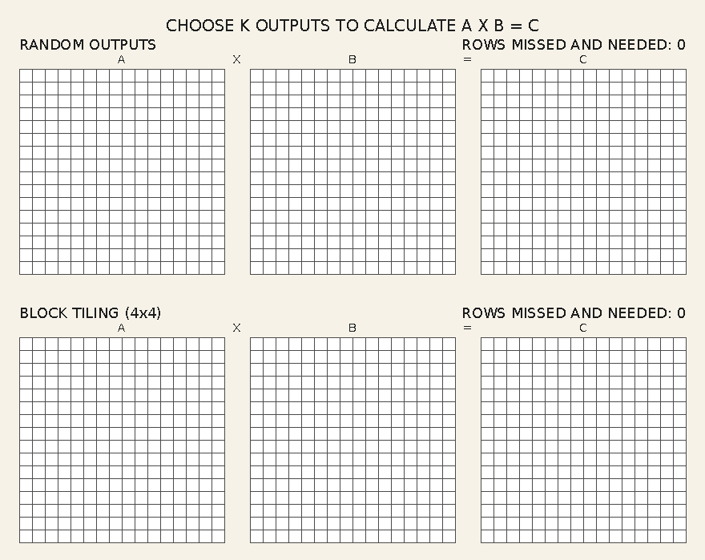

# Blocking / Tiling Matrix Multiplication Visualization

This repo generates a single GIF that contrasts two output-selection strategies
for matrix multiplication:



- **Top**: random output selection (high reuse cost across A rows and B columns).
- **Bottom**: block tiling (compute an `N/4 x N/4` output tile to reuse rows/cols).

Each frame increments K (starting at 0), highlights the chosen output(s), and
shows the required input elements as a function of N (e.g., `2N`, `3N`). After
the first slide, a short dot-product animation sweeps across the first output
row/column while shading in the output cell.

## Setup

```bash
python3 -m venv .venv
. .venv/bin/activate
python -m pip install --upgrade pip
python -m pip install pillow
```

## Generate the GIF

```bash
python3 generate_gif.py --n 16
```

The output is written to:

```
out/N-16/matmul_blocking_vs_random_N16.gif
```

For N=24:

```
out/N-24/matmul_blocking_vs_random_N24.gif
```

## Configuration

- `--n`: matrix size (default: 16, must be divisible by 4)
- `--cell`: pixel size of each matrix cell (default: 16)
- `--seed`: random seed for the top-row selection (default: 7)
- `--duration`: frame duration in ms (default: 800)
- `--out`: output root directory (default: `out`)

### Font sizes (pixels)

Adjust the `FONT_SIZES` dict in `generate_gif.py`:

```python
FONT_SIZES = {
    "body_px": 18,
    "section_px": 24,
    "title_px": 28,
}
```

### Animation timing ramps

The acceleration curve is controlled by `DOT_RAMP` (dot-product sweep) and
`MAIN_RAMP` (rest of the outputs). You can set start/end acceleration and a
starting velocity:

```python
DOT_RAMP = {
    "start_factor": 0.4,
    "end_factor": 0.12,
    "min_start_ms": 200,
    "min_end_ms": 80,
    "velocity_start": 2.5,
    "accel_start": 2.0,
    "accel_end": 8.0,
}
```

Example:

```bash
python3 generate_gif.py --n 32 --cell 12 --duration 100
```
